# Class Diagram — Digital Forensics & Evidence Chain Management System

This document contains the complete **UML Class Diagram** for the Digital Forensics & Evidence Chain Management System, illustrating all classes, interfaces, relationships, methods, and design patterns.

```mermaid
classDiagram
    direction TB

    %% ------------------- MAIN CLIENT -------------------
    class InvestigatorClient {
        +main(String[] args)$ void
    }

    %% ------------------- SINGLETON: DB -------------------
    class DatabaseConnection {
        -Connection instance$
        -String URL$
        -DatabaseConnection()
        +getInstance()$ Connection
        -initTables(Connection conn)$ void
    }
    <<Singleton>> DatabaseConnection

    %% ------------------- PROXY PATTERN -------------------
    class IForensicSystem {
        <<Interface>>
        +submitEvidence(Evidence evidence)* void
    }

    class ForensicSystemProxy {
        -ForensicManagerSystem realSystem
        +ForensicSystemProxy()
        +authenticateUser(String investigatorId, String name, int password) boolean
        +insertEvidence(String investigatorId, String evidenceType, int riskScore, String status, String notification) void
        +submitEvidence(Evidence evidence) void
    }

    class ForensicManagerSystem {
        +submitEvidence(Evidence evidence) void
    }

    IForensicSystem <|.. ForensicSystemProxy : implements
    IForensicSystem <|.. ForensicManagerSystem : implements
    ForensicSystemProxy o-- ForensicManagerSystem : delegates to

    %% ------------------- ABSTRACT FACTORY PATTERN -------------------
    class AbstractFactory {
        <<Interface>>
        +createDiskImage(int riskScore)* Evidence
        +createMobileBackup(int riskScore)* Evidence
        +createNetworkCapture(int riskScore)* Evidence
    }

    class SeniorInvestigator {
        +createDiskImage(int riskScore) Evidence
        +createMobileBackup(int riskScore) Evidence
        +createNetworkCapture(int riskScore) Evidence
    }

    class JuniorInvestigator {
        +createDiskImage(int riskScore) Evidence
        +createMobileBackup(int riskScore) Evidence
        +createNetworkCapture(int riskScore) Evidence
    }

    class EvidenceFactory {
        +getEvidence(String evidenceType, int riskScore) Evidence
    }

    AbstractFactory <|.. SeniorInvestigator : implements
    AbstractFactory <|.. JuniorInvestigator : implements

    %% ------------------- PRODUCT HIERARCHY & BRIDGE -------------------
    class Evidence {
        <<Abstract>>
        #String evidenceType
        #int riskScore
        #String description
        #NotificationChannel notificationChannel
        +Evidence(String evidenceType, int riskScore, String description)
        +setNotificationChannel(NotificationChannel notificationChannel) void
        +notifyStatus(String status) void
        +getRiskScore() int
        +getEvidenceType() String
        +displayEvidenceDetails()* void
    }

    class DiskImage {
        +DiskImage(int riskScore)
        +displayEvidenceDetails() void
    }

    class MobileBackup {
        +MobileBackup(int riskScore)
        +displayEvidenceDetails() void
    }

    class NetworkCapture {
        +NetworkCapture(int riskScore)
        +displayEvidenceDetails() void
    }

    Evidence <|-- DiskImage : extends
    Evidence <|-- MobileBackup : extends
    Evidence <|-- NetworkCapture : extends

    SeniorInvestigator ..> DiskImage : creates
    SeniorInvestigator ..> MobileBackup : creates
    SeniorInvestigator ..> NetworkCapture : creates
    JuniorInvestigator ..> DiskImage : creates
    JuniorInvestigator ..> NetworkCapture : creates

    %% ------------------- BRIDGE NOTIFICATION -------------------
    class NotificationChannel {
        <<Interface>>
        +sendNotification(String message)* void
    }

    class EmailNotification {
        +sendNotification(String message) void
    }

    class SMSNotification {
        +sendNotification(String message) void
    }

    class MobileAppNotification {
        +sendNotification(String message) void
    }

    NotificationChannel <|.. EmailNotification : implements
    NotificationChannel <|.. SMSNotification : implements
    NotificationChannel <|.. MobileAppNotification : implements

    Evidence o-- NotificationChannel : Bridge (has-a)

    %% ------------------- SINGLETON: APPROVER SYSTEM -------------------
    class EvidenceApproverSystem {
        -EvidenceApproverSystem instance$
        -EvidenceApprover approverChain
        -EvidenceCoordinator coordinator
        -EvidenceApproverSystem()
        +getInstance()$ EvidenceApproverSystem
        +getCoordinator() EvidenceCoordinator
        +processEvidence(Evidence evidence, String investigatorId) void
    }
    <<Singleton>> EvidenceApproverSystem

    %% ------------------- CHAIN OF RESPONSIBILITY -------------------
    class EvidenceApprover {
        <<Abstract>>
        #EvidenceApprover nextApprover
        #EvidenceCoordinator coordinator
        +EvidenceApprover(EvidenceCoordinator coordinator)
        +SetNextApprover(EvidenceApprover nextApprover) void
        +ApproveEvidence(Evidence evidence, String investigatorId)* void
    }

    class HashVerifier {
        +HashVerifier(EvidenceCoordinator coordinator)
        +ApproveEvidence(Evidence evidence, String investigatorId) void
    }

    class IntegrityChecker {
        +IntegrityChecker(EvidenceCoordinator coordinator)
        +ApproveEvidence(Evidence evidence, String investigatorId) void
    }

    class ChiefAnalyst {
        +ChiefAnalyst(EvidenceCoordinator coordinator)
        +ApproveEvidence(Evidence evidence, String investigatorId) void
    }

    EvidenceApprover <|-- HashVerifier : extends
    EvidenceApprover <|-- IntegrityChecker : extends
    EvidenceApprover <|-- ChiefAnalyst : extends
    EvidenceApprover --> EvidenceApprover : nextApprover

    EvidenceApproverSystem o-- EvidenceApprover : holds chain

    %% ------------------- OBSERVER PATTERN -------------------
    class EvidenceCoordinator {
        -List~EvidenceObserver~ observers
        +registerObserver(EvidenceObserver observer) void
        +removeObserver(EvidenceObserver observer) void
        -notifyObservers(EvidenceRequest request) void
        +onEvidenceApproved(EvidenceRequest request) void
        -updateEvidenceStatusToApproved(String investigatorId, String evidenceType) void
        +rejectEvidenceRequest(String investigatorId, String evidenceType) void
        +cancelEvidenceRequest(String investigatorId, String evidenceType) void
    }

    class EvidenceObserver {
        <<Interface>>
        +update(EvidenceRequest request)* void
    }

    class EvidenceRequest {
        -String investigatorId
        -String evidenceType
        -int riskScore
        +EvidenceRequest(String investigatorId, String evidenceType, int riskScore)
        +getInvestigatorId() String
        +getEvidenceType() String
        +getRiskScore() int
    }

    class AuditDepartment {
        +update(EvidenceRequest request) void
    }

    class ForensicsLab {
        +update(EvidenceRequest request) void
    }

    EvidenceObserver <|.. AuditDepartment : implements
    EvidenceObserver <|.. ForensicsLab : implements
    EvidenceCoordinator o-- EvidenceObserver : notifies (0..*)
    EvidenceApprover --> EvidenceCoordinator : triggers
    EvidenceApproverSystem o-- EvidenceCoordinator : manages

    %% ------------------- CLIENT USAGE -------------------
    InvestigatorClient ..> EvidenceApproverSystem : uses
    InvestigatorClient ..> ForensicSystemProxy : uses
    InvestigatorClient ..> AbstractFactory : uses
    InvestigatorClient ..> Evidence : uses
    InvestigatorClient ..> NotificationChannel : uses
    InvestigatorClient ..> DatabaseConnection : uses
```

