# Digital Forensics & Evidence Chain Management System — Complete Reference

**Project:** Digital Forensics & Evidence Chain Management System (Java + SQLite)  
**Location:** `c:\Users\likhi\Desktop\DP_LAB_PROG\Forensics_Evidence_Management`  
**Database:** `database/ForensicManagementDatabase.db` (SQLite)  
**Total Java Files:** 27 files (< 30 files limit) | **Design Patterns Implemented:** 6  

---

## Table of Contents
1. [System Architecture & Design Patterns](#1-system-architecture--design-patterns)
2. [Complete Workflow (Step-by-Step)](#2-complete-workflow-step-by-step)
3. [Database Tables](#3-database-tables)
4. [Class Relationship Diagram](#4-class-relationship-diagram)
5. [All Source Files](#5-all-source-files)

---

## 1. System Architecture & Design Patterns

| Pattern | Role | Classes Involved |
|:---|:---|:---|
| **Singleton** | Only one DB connection + one ApproverSystem instance | `DatabaseConnection`, `EvidenceApproverSystem` |
| **Proxy** | Guards access; authenticates before real system is used | `IForensicSystem`, `ForensicSystemProxy`, `ForensicManagerSystem` |
| **Abstract Factory** | Creates evidence objects based on investigator type | `AbstractFactory`, `SeniorInvestigator`, `JuniorInvestigator` |
| **Factory Method** | Centralised object creation by type code | `EvidenceFactory` |
| **Bridge** | Decouples Evidence class from notification delivery | `NotificationChannel`, `EmailNotification`, `SMSNotification`, `MobileAppNotification` |
| **Chain of Responsibility** | Routes evidence approval to the right authority based on risk score | `EvidenceApprover`, `HashVerifier`, `IntegrityChecker`, `ChiefAnalyst` |
| **Observer** | Auto-notifies Audit & Lab departments after approval | `EvidenceObserver`, `EvidenceCoordinator`, `AuditDepartment`, `ForensicsLab` |

---

## 2. Complete Workflow (Step-by-Step)

```
STEP 1 — LOGIN
 Investigator enters: InvestigatorID, Name, Password
 → Proxy.authenticateUser() → SELECT * FROM Investigator_Info WHERE ...
 → If no match → "Access Denied" → EXIT

STEP 2 — FETCH INVESTIGATOR TYPE (from DB)
 → SELECT Investigator_Type FROM Investigator_Info WHERE InvestigatorID = ?
 → "Senior Investigator" → factory = new SeniorInvestigator()
 → "Junior Investigator" → factory = new JuniorInvestigator()

STEP 3 — INPUT EVIDENCE DETAILS
 Investigator enters: Evidence Type (DISK / MOBILE / NETWORK), Risk Score (1-10)

STEP 4 — CHOOSE NOTIFICATION CHANNEL (Bridge Pattern)
 Investigator enters: Email / SMS / App
 → Creates EmailNotification / SMSNotification / MobileAppNotification

STEP 5 — VALIDATE EVIDENCE TYPE (Abstract Factory)
 factory.createDiskImage(risk)      → always returns DiskImage object
 factory.createMobileBackup(risk)   → SeniorInvestigator: MobileBackup object
                                      JuniorInvestigator: null → REJECTED
 factory.createNetworkCapture(risk) → always returns NetworkCapture object
 → If null → INSERT Rejected record → EXIT

STEP 6 — VALIDATE PENDING CASE CAPACITY (Audit_Dept table)
 → SELECT PendingCases FROM Audit_Dept WHERE InvestigatorID = ?
 → PendingCases <= 0 → INSERT Rejected record → EXIT

STEP 7 — SUBMIT AS PENDING
 → Proxy.insertEvidence(investigatorId, evidenceType, riskScore, "Pending", channel)
 → INSERT INTO EvidenceRecord (...) VALUES (...)
 → Proxy delegates to RealSystem → evidence.displayEvidenceDetails()

STEP 8 — APPROVAL CHAIN (Chain of Responsibility)
 approverSystem.processEvidence(evidence, investigatorId)
 ├── HashVerifier.ApproveEvidence()
 │    riskScore <= 2 → APPROVED by HashVerifier
 │    riskScore > 2  → pass to IntegrityChecker
 ├── IntegrityChecker.ApproveEvidence()
 │    riskScore <= 7 → APPROVED by IntegrityChecker
 │    riskScore > 7  → pass to ChiefAnalyst
 └── ChiefAnalyst.ApproveEvidence()
      always         → APPROVED by ChiefAnalyst

 On Approval → coordinator.onEvidenceApproved(request)
 1. UPDATE EvidenceRecord SET Status='Approved' WHERE InvestigatorID=? AND EvidenceType=? AND Status='Pending'
 2. AuditDepartment.update() → UPDATE Audit_Dept SET PendingCases = PendingCases - 1 WHERE InvestigatorID=?
 3. ForensicsLab.update()    → UPDATE Lab_Records SET AllocatedHours = AllocatedHours - (10 * riskScore) WHERE InvestigatorID=?
 4. Bridge                   → evidence.notifyStatus() → channel.sendNotification(message)
```

### Approval Authority Table
| Approver | Handles (Risk Score) | Action if Exceeds |
|:---|:---|:---|
| **HashVerifier** | 1 – 2 | Pass to IntegrityChecker |
| **IntegrityChecker** | 3 – 7 | Pass to ChiefAnalyst |
| **ChiefAnalyst** | 8+ | Always Approves |

---

## 3. Database Tables

**Database file:** `database/ForensicManagementDatabase.db`  
**Driver:** SQLite JDBC (`jdbc:sqlite:...`)

### Table 1: `Investigator_Info`
*Used for: Login authentication (Step 1) and investigator type lookup (Step 2).*
```sql
CREATE TABLE Investigator_Info (
    InvestigatorID TEXT PRIMARY KEY,
    Name TEXT,
    Password INTEGER,
    Investigator_Type TEXT
);
```

### Table 2: `EvidenceRecord`
*Used for: Recording every evidence request (Pending / Approved / Rejected).*
```sql
CREATE TABLE EvidenceRecord (
    InvestigatorID TEXT,
    EvidenceType TEXT,
    RiskScore INTEGER,
    Status TEXT,
    Notification TEXT
);
```

### Table 3: `Audit_Dept`
*Used for: Case capacity check (Step 6) and deduction after approval (Step 8 $\rightarrow$ Observer).*
```sql
CREATE TABLE Audit_Dept (
    InvestigatorID TEXT,
    PendingCases INTEGER
);
```

### Table 4: `Lab_Records`
*Used for: Analysis lab hours allocation after evidence approval (Step 8 $\rightarrow$ Observer). Deduction = 10 hrs $\times$ RiskScore.*
```sql
CREATE TABLE Lab_Records (
    InvestigatorID TEXT,
    AllocatedHours INTEGER
);
```

---

## 4. Class Relationship Diagram

```mermaid
classDiagram
    direction TB

    %% SINGLETONS
    class DatabaseConnection {
        <<Singleton>>
        +getInstance()$ Connection
    }
    class EvidenceApproverSystem {
        <<Singleton>>
        +getInstance()$ EvidenceApproverSystem
        +processEvidence(Evidence evidence, String investigatorId) void
    }

    %% PROXY
    class IForensicSystem {
        <<Interface>>
        +submitEvidence(Evidence evidence)* void
    }
    class ForensicSystemProxy {
        +authenticateUser() boolean
        +insertEvidence() void
        +submitEvidence(Evidence evidence) void
    }
    class ForensicManagerSystem {
        +submitEvidence(Evidence evidence) void
    }
    IForensicSystem <|.. ForensicSystemProxy
    IForensicSystem <|.. ForensicManagerSystem
    ForensicSystemProxy o-- ForensicManagerSystem

    %% ABSTRACT FACTORY
    class AbstractFactory {
        <<Interface>>
        +createDiskImage(int riskScore)* Evidence
        +createMobileBackup(int riskScore)* Evidence
        +createNetworkCapture(int riskScore)* Evidence
    }
    class SeniorInvestigator {
        +createDiskImage() Evidence
        +createMobileBackup() Evidence
        +createNetworkCapture() Evidence
    }
    class JuniorInvestigator {
        +createDiskImage() Evidence
        +createMobileBackup() null
        +createNetworkCapture() Evidence
    }
    AbstractFactory <|.. SeniorInvestigator
    AbstractFactory <|.. JuniorInvestigator

    %% PRODUCT & BRIDGE
    class Evidence {
        <<Abstract>>
        #NotificationChannel notificationChannel
        +setNotificationChannel(NotificationChannel ch) void
        +notifyStatus(String status) void
        +displayEvidenceDetails()* void
    }
    class DiskImage { +displayEvidenceDetails() void }
    class MobileBackup { +displayEvidenceDetails() void }
    class NetworkCapture { +displayEvidenceDetails() void }
    Evidence <|-- DiskImage
    Evidence <|-- MobileBackup
    Evidence <|-- NetworkCapture

    class NotificationChannel {
        <<Interface>>
        +sendNotification(String message)* void
    }
    class EmailNotification { +sendNotification(String message) void }
    class SMSNotification { +sendNotification(String message) void }
    class MobileAppNotification { +sendNotification(String message) void }
    NotificationChannel <|.. EmailNotification
    NotificationChannel <|.. SMSNotification
    NotificationChannel <|.. MobileAppNotification
    Evidence o-- NotificationChannel

    %% CHAIN OF RESPONSIBILITY
    class EvidenceApprover {
        <<Abstract>>
        #EvidenceApprover nextApprover
        #EvidenceCoordinator coordinator
        +ApproveEvidence(Evidence evidence, String investigatorId)* void
    }
    class HashVerifier { +ApproveEvidence() void }
    class IntegrityChecker { +ApproveEvidence() void }
    class ChiefAnalyst { +ApproveEvidence() void }
    EvidenceApprover <|-- HashVerifier
    EvidenceApprover <|-- IntegrityChecker
    EvidenceApprover <|-- ChiefAnalyst
    EvidenceApprover --> EvidenceApprover : nextApprover
    EvidenceApproverSystem o-- EvidenceApprover

    %% OBSERVER
    class EvidenceCoordinator {
        +registerObserver(EvidenceObserver o) void
        +onEvidenceApproved(EvidenceRequest req) void
    }
    class EvidenceObserver {
        <<Interface>>
        +update(EvidenceRequest req)* void
    }
    class AuditDepartment { +update(EvidenceRequest req) void }
    class ForensicsLab { +update(EvidenceRequest req) void }
    EvidenceObserver <|.. AuditDepartment
    EvidenceObserver <|.. ForensicsLab
    EvidenceCoordinator o-- EvidenceObserver
    EvidenceApproverSystem o-- EvidenceCoordinator
```



```
InvestigatorClient (main)
 │
 ├── ForensicSystemProxy ──────(implements)─────► IForensicSystem
 │    └── ForensicManagerSystem ──(implements)─────► IForensicSystem
 │         └── evidence.displayEvidenceDetails() [Polymorphism]
 │
 ├── DatabaseConnection [Singleton] ── SQLite DB connection
 │
 ├── AbstractFactory [Interface]
 │    ├── SeniorInvestigator ── creates DiskImage, MobileBackup, NetworkCapture
 │    └── JuniorInvestigator ── creates DiskImage, null (Mobile), NetworkCapture
 │
 ├── Evidence [Abstract]
 │    ├── DiskImage
 │    ├── MobileBackup
 │    └── NetworkCapture
 │
 ├── NotificationChannel [Interface — Bridge]
 │    ├── EmailNotification
 │    ├── SMSNotification
 │    └── MobileAppNotification
 │
 └── EvidenceApproverSystem [Singleton]
      ├── EvidenceCoordinator [Observer Subject]
      │    ├── AuditDepartment ──(implements)──► EvidenceObserver
      │    └── ForensicsLab    ──(implements)──► EvidenceObserver
      │
      └── Chain: HashVerifier ──► IntegrityChecker ──► ChiefAnalyst
           all extend EvidenceApprover [Abstract]
```

---

## 5. All Source Files (27 Files)

1. `InvestigatorClient.java` — Main entry point driving the complete 8-step workflow.
2. `DatabaseConnection.java` — Singleton DB Connection.
3. `IForensicSystem.java` — Proxy Interface.
4. `ForensicSystemProxy.java` — Proxy guarding real system with DB authentication and inserts.
5. `ForensicManagerSystem.java` — Real Subject executing polymorphic evidence display.
6. `AbstractFactory.java` — Abstract Factory Interface.
7. `SeniorInvestigator.java` — Concrete Factory #1 creating all 3 evidence types.
8. `JuniorInvestigator.java` — Concrete Factory #2 (Mobile Backup returns null).
9. `EvidenceFactory.java` — Simple Factory Method.
10. `Evidence.java` — Abstract Product & Bridge Abstraction.
11. `DiskImage.java` — Concrete Product #1.
12. `MobileBackup.java` — Concrete Product #2.
13. `NetworkCapture.java` — Concrete Product #3.
14. `NotificationChannel.java` — Bridge Interface.
15. `EmailNotification.java` — Concrete Channel: Email.
16. `SMSNotification.java` — Concrete Channel: SMS.
17. `MobileAppNotification.java` — Concrete Channel: Mobile App.
18. `EvidenceApproverSystem.java` — Singleton wiring Chain and Observer together.
19. `EvidenceApprover.java` — Abstract Handler for Chain of Responsibility.
20. `HashVerifier.java` — Chain Handler #1 (Risk Score 1–2).
21. `IntegrityChecker.java` — Chain Handler #2 (Risk Score 3–7).
22. `ChiefAnalyst.java` — Chain Handler #3 (Risk Score 8+).
23. `EvidenceCoordinator.java` — Observer Subject.
24. `EvidenceObserver.java` — Observer Interface.
25. `EvidenceRequest.java` — Data Transfer Object.
26. `AuditDepartment.java` — Observer #1 (Updates pending cases in DB).
27. `ForensicsLab.java` — Observer #2 (Allocates lab hours in DB).
